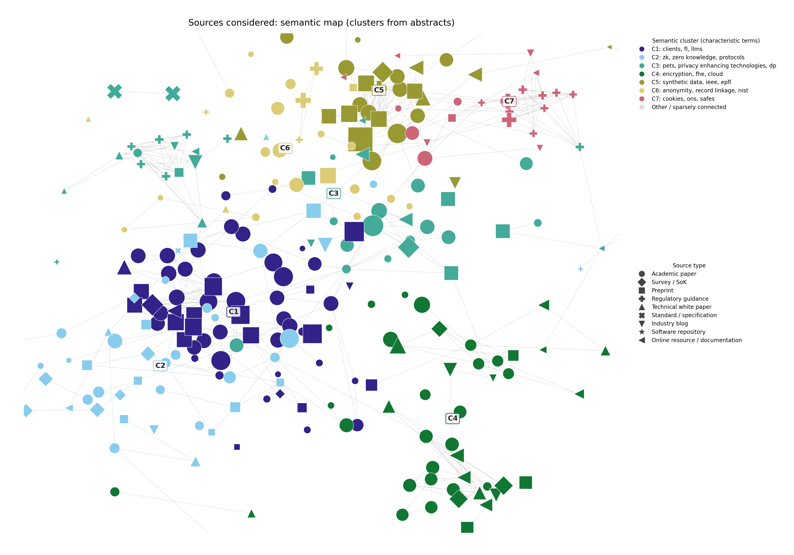
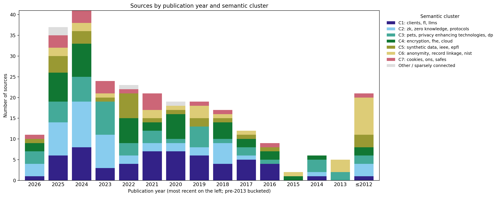
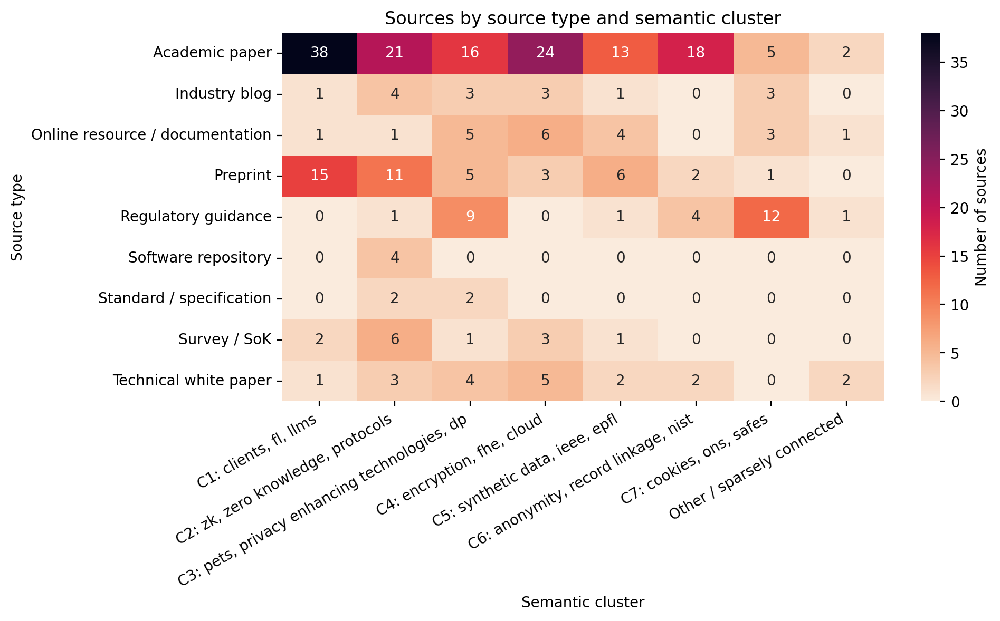
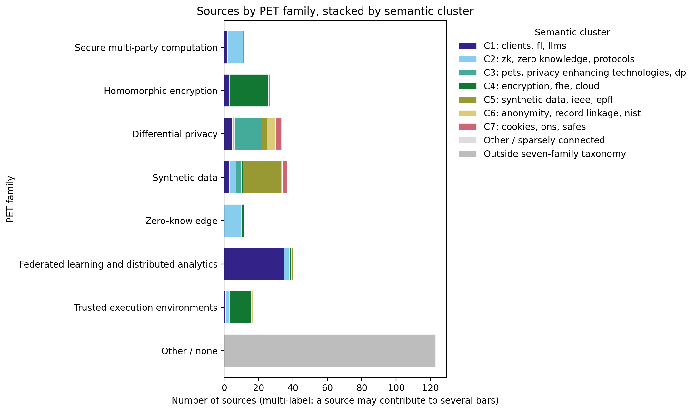

# Survey source visualisation

A reproducible pipeline that produces the semantic map of sources placed
between the Introduction and Section 2 of the PETs survey. The figure depicts
**what kinds of sources were considered, how they relate, and the themes that
emerge from them** — the clusters are discovered from the corpus, not imposed.
It is an analytical artefact, not decoration: any visible imbalance is reported
as a finding about the evidence base rather than corrected away.

## Figures

The two figures the survey embeds are the **semantic map** and the
**publication-date timeline**; two further supporting figures (a type×cluster
heatmap and a PET-family breakdown) live in the appendix/repository. All four
are regenerated deterministically by one command:

```bash
python -m src.build_figures
```

The build is reproducible: given the same `data/sources.csv` and
`data/source_text.csv` it produces the same figures every time (fixed seeds
throughout, and the clustering is made robust to Python hash randomisation —
see Methodology). It writes a machine-readable `data/figure_metrics.json` and a
per-source `data/semantic_clusters.csv` so the numbers behind the figures can
be inspected without opening a plotting library.

### Main figure — semantic map of sources



**Purpose.** The figure goes between the Introduction and Section 2 of the
survey. It answers a single question: **what kinds of sources did we read,
and how do they relate to each other?** It is a *science map* in the
bibliometric sense (van Eck & Waltman, 2010):

- **Colour = emergent semantic cluster.** Clusters are not assigned from an
  a-priori topic list; they are *discovered* by partitioning the
  **abstract**-similarity network with the Louvain modularity method (Blondel
  et al., 2008) and then labelled by their most characteristic terms
  (class-based TF-IDF, the classical analogue of BERTopic's c-TF-IDF;
  Grootendorst, 2022). The legend shows each cluster's top terms. The palette
  is Paul Tol's colour-blind-safe "muted" scheme, and each cluster is also
  labelled at its centroid so the map reads without colour alone.
- **Shape = publication type** (academic paper, preprint, regulatory guidance,
  online resource, …).
- **Size = degree** — how strongly a source is connected to the rest.
- **Edges = TF-IDF cosine similarity** between source **abstracts**, capped to
  each source's nearest neighbours (the VOSviewer association cap). The layout
  is force-directed (Fruchterman–Reingold) and pure-semantic, so clusters
  separate spatially.

**Why clusters rather than a fixed topic colour?** Scoring sources against an
a-priori keyword vocabulary produced near-tie margins — an authoritative-looking
near-coin-flip. Letting the corpus define its own clusters from the abstracts is
both more honest and more informative — and, reassuringly, the emergent clusters
recover the survey's own themes (federated learning, confidential computing,
health-data governance, synthetic data, secure multi-party computation,
homomorphic encryption, zero-knowledge proofs, PETs policy, and anonymity /
record linkage) without being told them.

### Sources by publication year and semantic cluster



**Purpose.** A stacked-bar timeline of the bibliography over time, stacked by
the same semantic clusters so the two figures tell one story. Publication year
is the reliable axis here. **The x-axis is descending (most recent year on the
left)**: the bibliography skews heavily recent, so reading left-to-right leads
with that recency. Years before 2013 are bucketed into a single bar to avoid a
thin, label-crowded tail.

### Source type × semantic cluster heatmap (supporting)



**Purpose.** A reviewer-friendly crosstab: publication type (rows) against
semantic cluster (columns), cell intensity = source count. It shows whether a
cluster's evidence base is dominated by one source type — a cluster supported
only by regulatory guidance carries different epistemic weight to one
supported by peer-reviewed papers.

### PET-family breakdown (supporting)



**Purpose.** "Which PETs do the cited sources actually consider?" Horizontal
bars cover the seven PET families the survey explicitly defines (secure MPC,
homomorphic encryption, differential privacy, synthetic data, zero-knowledge,
federated learning and distributed analytics, trusted execution environments),
stacked by semantic cluster. **The bars are multi-label**: a source tagged
`differential_privacy;federated_learning` contributes one unit to both bars,
so the totals across bars exceed the source count by design. Sources carrying
no tag from the seven families are reported in a separate grey "Other / none"
bar so they remain visible.

## Repository layout

```
survey-source-visualisation/
├── README.md
├── reference_list.txt              # the bibliography (Cite Them Right Harvard)
├── requirements.txt
├── data/
│   ├── topic_vocabulary.yaml       # controlled vocabulary + heuristic patterns
│   ├── sources.csv                 # parser output, the audited source of truth
│   ├── source_text.csv             # text payloads (produced by acquire_text.py)
│   ├── topic_suggestions.csv       # ranked topic suggestions for human review
│   ├── semantic_clusters.csv       # per-source emergent cluster + label (build output)
│   ├── figure_metrics.json         # machine-readable build summary (build output)
│   └── abstracts_cache/            # cached abstracts and human overrides
├── notebooks/
│   └── semantic_map.ipynb          # interactive walk-through of the pipeline
├── src/
│   ├── parse_references.py         # Stage 1 - bibliography → metadata
│   ├── acquire_text.py             # Stage 2 - acquire text by source type
│   ├── preprocess.py               # Stage 3 - normalise text
│   ├── features.py                 # Stage 4 - TF-IDF and embeddings
│   ├── topic_assignment.py         # Stage 5 - controlled-vocabulary topic scoring (human-review aid)
│   ├── semantic_clusters.py        # Stage 5 - emergent science-mapping clusters (drives figure colour)
│   ├── graph.py                    # Stage 6 - typed multi-edge graph
│   ├── visualise.py                # Stage 7 - matplotlib + pyvis rendering
│   └── build_figures.py            # headless end-to-end build (Stages 3-7)
├── docs/
│   ├── methodology.md              # the long-form methodology
│   ├── data_dictionary.md          # column-by-column reference for sources.csv
│   └── topic_assignment_guide.md   # how a reviewer confirms or overrides topics
└── figures/                        # rendered output (regenerable from the notebook)
```

## Quick start

```bash
python3 -m venv .venv
source .venv/bin/activate
pip install -r requirements.txt

# Stage 1 - parse the bibliography into structured metadata
python -m src.parse_references

# Stage 2 - acquire the abstract / type-appropriate description per source
#           (arXiv, Crossref, Semantic Scholar, OpenAlex, then landing pages).
#           Writes data/source_text.csv with full provenance. Needs network.
python -m src.acquire_text --write-cache

# Stages 3-7 - build every figure headlessly and deterministically
python -m src.build_figures

# (or, to explore the pipeline interactively)
jupyter lab notebooks/semantic_map.ipynb
```

`build_figures` reads `data/source_text.csv` for the clustering text. It
**also runs without Stage 2**: any source lacking an acquired abstract falls
back to its title (or, for untitled reports, the venue lead), recorded as
`title_fallback`. If the NLTK corpora are not installed the normalisation
degrades to lower-casing and says so; the build still completes.

## Adding new sources later

The pipeline is built to be re-run as the bibliography grows. Every source
carries a content-derived stable id (`ref-XXXXXXXX`, an 8-character SHA-1
prefix over the normalised entry text). The id does not depend on bibliography
position, so you can insert references anywhere in `reference_list.txt`
without disturbing existing rows.

The workflow:

```bash
# 1. Edit reference_list.txt - append, insert, or remove entries.

# 2. Re-parse. By default this runs in MERGE mode: it reads the existing
#    sources.csv, indexes it by id, and copies your curated columns onto
#    the freshly parsed rows.
python -m src.parse_references
```

The parser prints a merge report. Read it carefully:

```
parsed 235 entries (previously 229)
  added:   6                          ← newly added bibliography entries
  removed: 0                          ← entries you have removed
  curated rows preserved: 47          ← reviewer decisions that survived
  duplicate entries collapsed: 2      ← identical text under multiple numbers
```

- **`added_ids`** — go to `data/topic_suggestions.csv` after the notebook
  has run, accept or override each suggestion, and update `sources.csv`.
- **`removed_ids`** — entries that were present in the prior `sources.csv`
  but are absent from the current `reference_list.txt`. If `curated_dropped`
  is non-zero, the parser exits with status 2 so a script can surface the
  lost work. (You can also see the ids in the printed report and recover
  curation from version control if a removal was unintended.)
- **`duplicates`** — two entries with identical normalised text collapse to
  one row, keeping the lowest bibliography number. The other numbers are
  reported so you can deduplicate `reference_list.txt`.

### If a stable id changes

A reference's id changes only when its substantive text changes (a typo fix,
re-titling, switching publisher). The merge report will then show the old id
under `removed_ids` and the new id under `added_ids`. To migrate curation,
copy the relevant columns from the prior row to the new row and re-run.
This is a deliberate friction step — silent migration of curation across a
text edit would risk attaching the wrong primary topic to the wrong source.

### Rebuilding from scratch

Pass `--rebuild` to discard all curated columns and start fresh:

```bash
python -m src.parse_references --rebuild
```

Use this only when migrating id schemes or when you genuinely want to redo
the curation. The command does not delete cached abstracts in
`data/abstracts_cache/`; those remain keyed on the new ids.

## Methodology in brief

The full write-up lives in [docs/methodology.md](docs/methodology.md). In short, the pipeline is a
documented sequence — each decision can be reproduced or contested.

1. **Source inventory and classification** — every source gets one publication
   type, seeded by pattern from `topic_vocabulary.yaml` and open to manual
   override.
2. **Text acquisition (type-aware)** — the abstract for academic / preprint /
   survey sources (arXiv → Crossref → Semantic Scholar → OpenAlex → landing
   page); the page description for white papers, blogs, and web resources. The
   per-type model and its assumptions are documented in
   [docs/methodology.md §2](docs/methodology.md); provenance for every source
   is written to `data/source_text.csv`. Where nothing is obtainable the source
   falls back to its title, recorded as `title_fallback` (currently ≈88%
   acquired). Text is never invented.
3. **Normalisation** — lower-case, lemmatise, stop-word removal, multi-word PET
   phrase atomisation (`differential privacy` → `differential_privacy`).
4. **Semantic clustering (drives the figure)** — the abstract-similarity
   network is sparsified to k nearest neighbours, edges are normalised to
   *association strength* (van Eck & Waltman, 2010), and the network is
   partitioned into **emergent clusters** by Louvain modularity (Blondel et
   al., 2008), each labelled by characteristic terms. This is the colour
   encoding. The controlled-vocabulary topic scorer (`topic_assignment.py`) is
   retained only as an aid to the optional human-review workflow — it no longer
   colours the figure, because near-tie margins make an a-priori topic colour
   unreliable.
5. **Graph and visualisation** — semantic + PET-family edges, a semantic-
   dominated Fruchterman–Reingold layout, and a colour-blind-safe palette.

Everything from step 3 onward is deterministic given the inputs and the
seeds, which is what makes the clustering testable
([tests/test_semantic_clusters.py](tests/test_semantic_clusters.py)).

## Where the logic is borrowed from

The pipeline draws on a small number of well-established methodological
precedents. They are cited inline in the source modules; consolidated here for
the reader.

| Step | Borrowed from |
| --- | --- |
| Bag-of-words / TF-IDF representation | Salton & Buckley (1988), *Term-weighting approaches in automatic text retrieval* |
| Science mapping: k-NN cap + association-strength normalisation | van Eck & Waltman (2010), *Software survey: VOSviewer* |
| Emergent clustering by modularity (Louvain) | Blondel, Guillaume, Lambiotte & Lefebvre (2008), *Fast unfolding of communities in large networks*; Newman (2006), *Modularity and community structure* |
| Cluster labelling by class-based TF-IDF | Grootendorst (2022), *BERTopic* (c-TF-IDF), applied here in its classical TF-IDF form |
| Bibliographic-coupling-style (PET-family) edges | Kessler (1963), *Bibliographic coupling between scientific papers* |
| Atomic multi-word phrases | Mikolov et al. (2013), *Distributed representations of words and phrases* (used here over a curated phrase list rather than a frequency threshold) |
| Sentence-Transformer embeddings (optional alternative similarity) | Reimers & Gurevych (2019), *Sentence-BERT* |
| Force-directed network layout | Fruchterman & Reingold (1991), *Graph drawing by force-directed placement* |
| Bibliometric network framing | Chen (2006), *CiteSpace II*; Small (1973), *Co-citation in the scientific literature* |
| Human-in-the-loop transparency | Page et al. (2021), *PRISMA 2020*; Rethlefsen et al. (2021), *PRISMA-S* |
| Colour-blind-safe categorical palette | Brewer (1994), ColorBrewer |

The figure's clusters are **data-driven**: they emerge from the corpus rather
than from an imposed taxonomy. The author-defined topic vocabulary (mechanism /
systems / evaluation / assurance / governance / deployment / survey) is
retained for the optional human-review workflow and the PET-family tags; its
role and limitations are discussed in [docs/methodology.md](docs/methodology.md).

## Limitations

- The figure reflects **the sources considered in this survey**, not the
  entirety of the PETs literature.
- Clusters are computed from **abstracts** (the type-appropriate description for
  non-academic sources). Coverage is ≈88%; the remaining sources fall back to
  their title and are labelled `title_fallback` in `data/source_text.csv`.
  Clustering is strong at the cluster level (modularity ≈ 0.64), but a given
  source can sit in an adjacent cluster — the cluster *labels* are the
  trustworthy unit, not any single node's colour.
- PET-family tags and the controlled-vocabulary topics remain **author-defined**
  and are used for the supporting figure and the review workflow respectively.

If the figure surfaces a bias (e.g. an over-representation of governance- and
DP-focused sources), this is treated as a finding to be commented on later in
the paper, not a flaw to be hidden.

## Tests

A pytest suite under [tests/](tests/) covers the deterministic parts of the
pipeline:

```bash
.venv/bin/python -m pytest tests/
```

The suite exercises:

- the **reference parser** against representative live-bibliography entries
  (typographic quotes, arXiv preprints, year-with-suffix patterns, ISO
  standards, software repositories);
- the **semantic-clustering** logic
  ([tests/test_semantic_clusters.py](tests/test_semantic_clusters.py)) on
  small inputs with *planted* structure — the k-NN cap and threshold, the
  association-strength formula (checked against a hand-computed value), the
  recovery of two known blocks, the folding of singletons into "other", the
  cluster labelling, and determinism of the partition;
- the **text acquisition**
  ([tests/test_acquire_text.py](tests/test_acquire_text.py)) — the HTML/JSON
  extractors, OpenAlex inverted-index reconstruction, the title-match guard
  that stops a wrong paper's abstract being attached, and the type-aware
  escalation (arXiv → Crossref → … → fallback), all offline via monkeypatching;
- the **acquired-text coverage and integrity**
  ([tests/test_source_text.py](tests/test_source_text.py)) — every source has
  exactly one provenance row, the per-type strategy mapping holds, `ok` rows
  carry text, coverage is reported, and API-sourced abstracts whose returned
  title disagrees with ours are surfaced (a likely wrong DOI in the reference);
- the **end-to-end figure build**
  ([tests/test_figures.py](tests/test_figures.py)) against the real
  `data/sources.csv`: one node per source, every source clustered, sizes
  summing to N, the expected edge types, real modularity, text coverage,
  fully-populated publication types, sane years, and all four figure files;
- the controlled-vocabulary topic scoring, the three graph edge rules in
  isolation, and the rendering primitives as smoke tests.

The acquisition itself (live arXiv / Crossref / OpenAlex calls) and
sentence-transformer embeddings are integration concerns and are not run here;
`test_source_text.py` skips if `data/source_text.csv` has not been generated.
